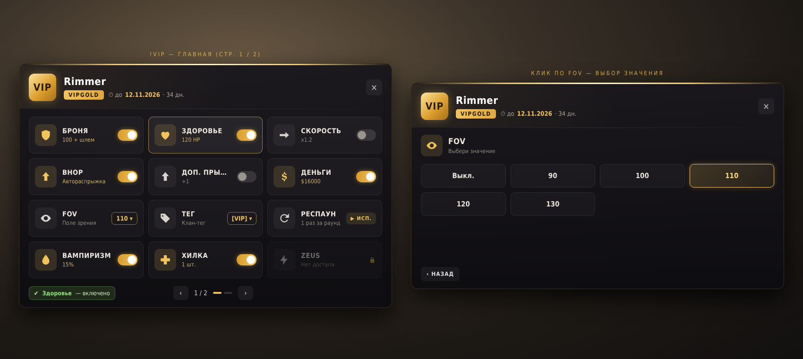

# PMM_VIPCore

<h2><a href="https://genesis-cs.space/menuconstructor/index.html">>>>Более подробная информация на сайте<<<</a></h2>



Bridge by **Rimmer** between [VIPCore](https://github.com/partiusfabaa/cs2-VIPCore) (thesamefabius) and [PanoramaMenuManager](https://github.com/RRimmer/PanoramaMenuManagerCS2) (MenuManagerCS2 1.2.03). VIPCore and its modules are not changed: Harmony patches them at runtime.

Current version: **0.1.1**. Needs CounterStrikeSharp 1.0.376 (.NET 10), the original VIPCore v1.3.3 and MenuManager 1.2.03.

- `!vip` and every VIP module menu open in MenuManager (the player's menu type from `!menu`).
- Own VIP panorama for PanoramaMenu players: nickname, VIP group and expiry in the header, 3×4 tiles with CS2 icons,
  values from `vip.json`, switches, value pickers (Fov, Tag), "No access" tiles, sub menus with "Back".
- Switches and pickers change in place — the menu does not jump back to page 1.
- Colours of the panel and of every VIP group are set in the config (`Paint.Theme`).
- All names and texts are edited in MenuManager's `MenuManager_Modules_Translation.json` (section `PMM_VIPCore`, per player language).

## Repository layout

| Folder | What it is |
| --- | --- |
| `PMM_VIPCore` | The plugin: `Plugin.cs` (Harmony, commands), `Bridge.cs` (VIPCore → MenuManager), `Paint.cs` (VIP panorama), `Theme.cs` + `theme.template.css` (colours), `Translations.cs`, `Config.cs` |
| `PMM_VIPCore/panorama` | Client files for the MultiAddonManager addon: `pmm_vip.xml`, `pmm_vip.css`, `pmm_vip_theme.css` |
| `PMM_VIPCore/lib` | `0Harmony.dll` (Lib.Harmony 2.4.2, net10.0) |
| `tools` | `gen_layout.py` — generates the panorama files (`python3 tools/gen_layout.py PMM_VIPCore`) |
| `MenuManagerApi` | Compile-time library. Do not copy `MenuManagerApi.dll` next to this plugin |
| `configs` | Example config |

## Install from a Release

Copy `Server-plugins/counterstrikesharp` into `game/csgo/addons/`. You get:

- `plugins/PMM_VIPCore/PMM_VIPCore.dll`
- `plugins/PMM_VIPCore/harmony/0Harmony.dll`
- `configs/plugins/PMM_VIPCore/PMM_VIPCore.json`

`0Harmony.dll` stays only in `harmony/`. Restart the server after an install or update: `css_plugins reload` does not unload Harmony.
Use the original VIP_Fov / VIP_Tag builds — the ones from the old PMM fork fail with `MissingMethodException`.

Copy `Content-addonmanager/panorama` into the MultiAddonManager addon and rebuild it. After changing `Paint.Theme`
the plugin writes `pmm_vip_theme.css` next to its DLL (`css_pmm_vip css`); copy it into the addon and rebuild.

Server console: `css_pmm_vip` (status), `css_pmm_vip repatch`, `css_pmm_vip css`.

Full guide: [INSTALL.md](INSTALL.md).

## Build

You need the .NET 10 SDK.

```bash
dotnet build PMM_VIPCore.sln --configuration Release
```

Output: `PMM_VIPCore/bin/Release/net10.0/`. Ship `PMM_VIPCore.dll` and `harmony/0Harmony.dll`. Do not ship `CounterStrikeSharp.API.dll` or `MenuManagerApi.dll`.

The changelog is in [CHANGELOG.md](CHANGELOG.md).

## License

[GNU GPL v3](LICENSE).

---

# PMM_VIPCore

<h2><a href="https://genesis-cs.space/menuconstructor/index.html">>>>Более подробная информация на сайте<<<</a></h2>

Мост от **Rimmer** между [VIPCore](https://github.com/partiusfabaa/cs2-VIPCore) (thesamefabius) и [PanoramaMenuManager](https://github.com/RRimmer/PanoramaMenuManagerCS2) (MenuManagerCS2 1.2.03). VIPCore и модули не меняются: Harmony патчит их в рантайме.

Текущая версия: **0.1.1**. Нужен CounterStrikeSharp 1.0.376 (.NET 10), оригинальный VIPCore v1.3.3 и MenuManager 1.2.03.

- `!vip` и меню всех VIP-модулей открываются в MenuManager (тип меню игрока из `!menu`).
- Своя VIP-панорама для игроков с PanoramaMenu: ник, группа и срок VIP в шапке, плитки 3×4 с иконками CS2,
  значения из `vip.json`, тумблеры, выбор значения (Fov, Tag), плитки «Нет доступа», подменю с «Назад».
- Тумблеры и выбор значения меняются на месте — меню не перескакивает на 1-ю страницу.
- Цвета панели и каждой VIP-группы задаются в конфиге (`Paint.Theme`).
- Все названия и тексты правятся в `MenuManager_Modules_Translation.json` MenuManager (раздел `PMM_VIPCore`, по языку игрока).

## Что лежит в репозитории

| Папка | Зачем |
| --- | --- |
| `PMM_VIPCore` | Плагин: `Plugin.cs` (Harmony, команды), `Bridge.cs` (VIPCore → MenuManager), `Paint.cs` (VIP-панорама), `Theme.cs` + `theme.template.css` (цвета), `Translations.cs`, `Config.cs` |
| `PMM_VIPCore/panorama` | Клиентские файлы для аддона MultiAddonManager: `pmm_vip.xml`, `pmm_vip.css`, `pmm_vip_theme.css` |
| `PMM_VIPCore/lib` | `0Harmony.dll` (Lib.Harmony 2.4.2, net10.0) |
| `tools` | `gen_layout.py` — генерирует файлы панорамы (`python3 tools/gen_layout.py PMM_VIPCore`) |
| `MenuManagerApi` | Библиотека только для сборки. `MenuManagerApi.dll` рядом с этим плагином не клади |
| `configs` | Пример конфига |

## Установка с Release

`Server-plugins/counterstrikesharp` копируется в `game/csgo/addons/`. Получится:

- `plugins/PMM_VIPCore/PMM_VIPCore.dll`
- `plugins/PMM_VIPCore/harmony/0Harmony.dll`
- `configs/plugins/PMM_VIPCore/PMM_VIPCore.json`

`0Harmony.dll` лежит только в `harmony/`. После установки или обновления полностью перезапусти сервер: `css_plugins reload` не выгружает Harmony.
VIP_Fov / VIP_Tag нужны оригинальные — сборки из старого PMM-форка падают с `MissingMethodException`.

`Content-addonmanager/panorama` копируется в аддон MultiAddonManager, аддон пересобирается. После изменения `Paint.Theme`
плагин пишет `pmm_vip_theme.css` рядом со своей DLL (`css_pmm_vip css`); скопируй его в аддон и пересобери.

Консоль сервера: `css_pmm_vip` (статус), `css_pmm_vip repatch`, `css_pmm_vip css`.

Подробная инструкция: [INSTALL.md](INSTALL.md).

## Сборка

Нужен .NET 10 SDK.

```bash
dotnet build PMM_VIPCore.sln --configuration Release
```

Результат: `PMM_VIPCore/bin/Release/net10.0/`. В поставку входят `PMM_VIPCore.dll` и `harmony/0Harmony.dll`. `CounterStrikeSharp.API.dll` и `MenuManagerApi.dll` не клади.

История изменений — в [CHANGELOG.md](CHANGELOG.md).

## Лицензия

[GNU GPL v3](LICENSE).
